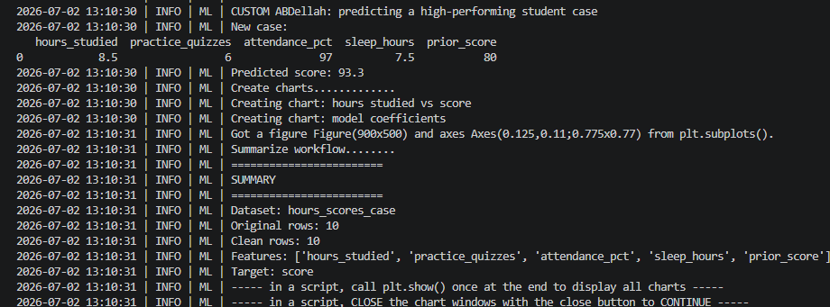

# ML Intro Project Documentation

This site provides documentation for my Module 1 machine learning introduction project.

## Project Overview

This project helped me practice setting up a professional Python project, running an existing machine learning example, making a small technical modification, and applying the same ideas to a new data problem.

The original example project uses a small student performance dataset called `hours_scores_case`. The example trains a supervised regression model to predict a student score using features such as hours studied, practice quizzes, attendance percentage, sleep hours, and prior score.

My custom work includes:

- Running the original example successfully
- Creating my own custom Python file named `app_abdellah.py`
- Changing the new student case used for prediction
- Running the modified project successfully
- Writing a custom machine learning problem idea for student exam performance

## Phase 4. Technical Modification

For Phase 4, I made a small technical modification by copying the original example file `app_case.py` and creating my own file named `app_abdellah.py`.

I kept the original example file unchanged so it can still work as a reference. In my custom file, I changed the new student case used for prediction.

The original example predicted a score for a student with these values:

- 6.5 hours studied
- 4 practice quizzes
- 92% attendance
- 7.0 sleep hours
- 72 prior score

My custom version predicts a score for a higher-performing student with these values:

- 8.5 hours studied
- 6 practice quizzes
- 97% attendance
- 7.5 sleep hours
- 80 prior score

I verified the change by running this command from the root project folder:

```shell
uv run python -m mlstudio.app_abdellah
```

The project ran successfully and printed my custom log message:

```text
CUSTOM Abdellah: predicting a high-performing student case
```

The modified project predicted a new score of:

```text
Predicted score: 93.3
```

The original example predicted a score of `83.4`, but my modified version predicted `93.3`. This confirms that my custom file worked and that my technical modification changed the behavior of the project.

This modification matters because it shows how changing the input feature values can affect the model prediction. A student with more hours studied, more practice quizzes, higher attendance, more sleep, and a higher prior score received a higher predicted score.

I would rate this modification as moderate. The code change itself was small, but I had to be careful to copy the example file instead of editing the original `app_case.py` file. I also had to make sure I ran the correct module command from the root project folder.

## Phase 4 Evidence

The screenshot below shows that my custom project ran successfully and printed the new predicted score.



## Phase 5. Custom Project (OPTIONAL in Module 1)

For Phase 5, I chose a simple custom project idea using a student exam performance dataset. Module 1 says Phase 5 is optional, so I focused on identifying the dataset, the features, the target, and the machine learning problem type.

### Basis and Data

The original example project uses the `hours_scores_case` dataset. It predicts a student score using features such as hours studied, practice quizzes, attendance percentage, sleep hours, and prior score.

For my custom project idea, I chose the **Students Performance in Exams** dataset from Kaggle.

Dataset link:

https://www.kaggle.com/datasets/spscientist/students-performance-in-exams

This dataset includes student exam scores and background features such as:

- gender
- race/ethnicity
- parental level of education
- lunch
- test preparation course
- math score
- reading score
- writing score

I chose this topic because student performance is easy to understand and it connects well to the original example project. Both problems use student-related data to predict an academic result.

The main limitation is that the dataset does not include some important factors, such as study hours, attendance, motivation, teacher quality, or school resources. These missing factors could affect the accuracy of the prediction.

### Modeling Approach

My machine learning question is:

**Given a student's reading score, writing score, test preparation course, lunch type, and parental level of education, I want to predict the student's math score.**

This is a supervised machine learning problem because there is a known target variable that the model can learn to predict. The target variable is `math score`.

This is also a regression problem because the target is a numeric value. If the target were a category, such as pass or fail, then it would be a classification problem. Since math score is a number, regression is the correct problem type.

The input features I would use are:

- reading score
- writing score
- test preparation course
- lunch type
- parental level of education

The target variable is:

- math score

### Summary

For this module, I implemented a technical modification by creating `app_abdellah.py` and changing the new prediction case. The project ran successfully and predicted a score of `93.3` for my custom student case.

For my custom project idea, I applied the same machine learning thinking to a new student performance problem. I identified the dataset, input features, target variable, and machine learning problem type.

I learned that a machine learning project needs a clear prediction question. I also learned the difference between features and a target, and how to identify whether a problem is classification or regression.

In the future, I could apply the same skills to other data problems, such as predicting house prices, customer spending, student grades, or whether a customer will return.

## Custom Commands

Run the original example:

```shell
uv run python -m mlstudio.app_case
```

Run my custom technical modification:

```shell
uv run python -m mlstudio.app_abdellah
```
